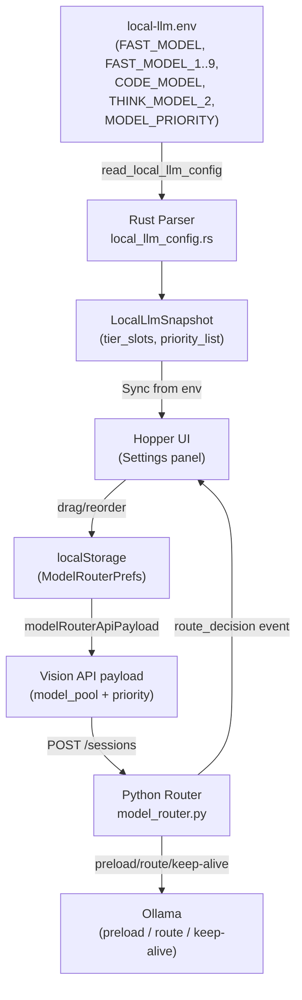

# Design Document: Model Priority Hopper

## Overview

This feature extends BrightVision's local model router hopper to support multiple models per tier and a `MODEL_PRIORITY` env var that controls preload order and routing preference. Today, each tier (fast/code/think) maps to exactly one model. After this change, users can assign numbered slots (`THINK_MODEL_1`, `THINK_MODEL_2`, etc.) and define a global priority ordering that determines which models stay warm in Ollama's unified memory and which get routed to first.

The design touches three layers:
1. **Rust parser** (`local_llm_config.rs`) — expanded KEYS allowlist and multi-slot snapshot
2. **Python router** (`model_router.py`) — priority-aware preloading and routing
3. **React hopper UI** — multi-model tier display with reorder, add, remove

Key constraint: backward-compatible. Existing single-model env files work without changes.

## Architecture



### Data Flow

1. **Startup / Sync**: Rust reads env files → produces `LocalLlmSnapshot` with `tier_slots` and `priority_list` → IPC to React → `applyLocalLlmHopperFromEnv` populates hopper entries in localStorage.
2. **Session create**: React builds `model_pool` payload from hopper entries (localStorage order) → POST to Python.
3. **Preload**: Python reads `priority_list` from payload → preloads models in order, respecting VRAM budget.
4. **Route**: Python picks highest-priority enabled model within the classified tier.
5. **Keep-alive**: Periodic warmup sends keep-alive requests in priority order.

## Components and Interfaces

### Rust Parser (`local_llm_config.rs`)

**Changes to `KEYS` allowlist:**
```rust
// New keys added dynamically via pattern match in parse_env_file
// FAST_MODEL_1..9, CODE_MODEL_1..9, THINK_MODEL_1..9, MODEL_PRIORITY
```

**New struct fields on `LocalLlmSnapshot`:**
```rust
/// Numbered tier slots: Vec of (tier, slot_number, model_tag).
/// Slot 0 = the base key (e.g. THINK_MODEL); slots 1-9 = numbered keys.
pub tier_slots: Vec<TierSlotEntry>,
/// Resolved priority list from MODEL_PRIORITY or derived default.
pub priority_list: Vec<String>,
/// Raw MODEL_PRIORITY env value (None when not set).
pub model_priority_raw: Option<String>,
```

**New struct:**
```rust
#[derive(Debug, Clone, Serialize)]
#[serde(rename_all = "camelCase")]
pub struct TierSlotEntry {
    pub tier: String,       // "fast" | "code" | "think"
    pub slot: u8,           // 0 = base key, 1-9 = numbered
    pub model_tag: String,  // Ollama tag
}
```

**Parsing logic:**
- `parse_env_file` matches keys against `^(FAST|CODE|THINK)_MODEL(_[1-9])?$` regex in addition to the static KEYS list.
- `MODEL_PRIORITY` is added to KEYS.
- After all files are read, `resolve_priority_list` converts `MODEL_PRIORITY` value (or derives default) into an ordered `Vec<String>` of model tags.

### TypeScript IPC (`localLlm.ts`)

**Extended `LocalLlmSnapshot` interface:**
```typescript
export interface TierSlotEntry {
  tier: 'fast' | 'code' | 'think'
  slot: number       // 0 = base, 1-9 = numbered
  modelTag: string   // Ollama tag
}

export interface LocalLlmSnapshot {
  // ... existing fields ...
  /** Multi-model tier slots parsed from env. */
  tierSlots?: TierSlotEntry[]
  /** Resolved priority list (model tags in priority order). */
  priorityList?: string[]
  /** Raw MODEL_PRIORITY env value. */
  modelPriorityRaw?: string | null
}
```

### Model Hopper (`modelHopper.ts`)

**Extended `ModelHopperEntry`:**
```typescript
export interface ModelHopperEntry {
  // ... existing fields ...
  /** Priority rank (0 = highest). Derived from MODEL_PRIORITY or hopper list order. */
  priorityRank?: number
  /** Slot number within the tier (0 = base key, 1-9 = numbered). */
  tierSlot?: number
  /** Whether to prefer the secondary model in this tier. */
  preferSecondary?: boolean
}
```

**New functions:**
```typescript
/** Build hopper entries from a multi-model LocalLlmSnapshot (Sync from env). */
export function buildHopperFromSnapshot(
  snap: LocalLlmSnapshot,
  sessionModel: string
): ModelHopperEntry[]

/** Reorder entries within a tier to match a priority list. */
export function applyPriorityOrder(
  entries: ModelHopperEntry[],
  priorityList: string[]
): ModelHopperEntry[]
```

### Python Router (`model_router.py`)

**Extended `ModelRouterConfig`:**
```python
@dataclass
class ModelRouterConfig:
    # ... existing fields ...
    priority_list: list[str] = field(default_factory=list)
```

**Extended `ModelPoolEntry`:**
```python
@dataclass
class ModelPoolEntry:
    # ... existing fields ...
    priority_rank: int | None = None
    prefer_secondary: bool = False
```

**New functions:**
```python
def resolve_tier_models(pool: list[ModelPoolEntry], tier: RouteRole) -> list[ModelPoolEntry]:
    """Return all enabled models for a tier, sorted by priority_rank."""

def pick_tier_model(
    pool: list[ModelPoolEntry],
    tier: RouteRole,
    *,
    resident_models: set[str] | None = None,
) -> tuple[str, bool]:
    """Pick the model to route to for a tier.
    Returns (model_name, is_swap).
    Respects prefer_secondary flag and priority ordering.
    """

async def preload_priority_list(
    priority_list: list[str],
    *,
    ollama_client: OllamaClient,
    vram_budget_bytes: int | None = None,
) -> list[str]:
    """Preload models in priority order, respecting VRAM budget.
    Returns list of successfully preloaded model tags.
    """
```

**Extended `RouteDecision`:**
```python
@dataclass
class RouteDecision:
    # ... existing fields ...
    priority_rank: int | None = None
    priority_list_snapshot: list[str] | None = None
```

### Hopper UI Components

**New component: `TierModelGroup`**
- Renders a tier heading with multiple model rows beneath it.
- Each row is draggable within its tier group for reorder.
- "Add model" button at the bottom of each tier group populates from `ollama tags`.
- "Remove" button on each row (disabled if only one code-tier model remains).

**Modified component: `ModelHopperPanel`**
- Detects multi-model tiers and renders `TierModelGroup` instead of flat rows.
- Single-model tiers render in legacy flat layout (backward compat).

## Data Models

### Env File Schema (extended)

```env
# Single model per tier (existing, still works)
FAST_MODEL=deepseek-coder:6.7b
CODE_MODEL=qwen3.6:27b-q4_K_M
THINK_MODEL=deepseek-r1:32b

# Multi-model slots (new)
THINK_MODEL_1=qwen3:30b-q4_K_M
THINK_MODEL_2=llama3:70b-q4_K_M
FAST_MODEL_1=qwen2.5-coder:7b

# Priority ordering (new)
MODEL_PRIORITY=deepseek-r1:32b,qwen3.6:27b-q4_K_M,deepseek-coder:6.7b,qwen2.5-coder:7b
# OR using tier labels:
MODEL_PRIORITY=THINK,CODE,FAST,FAST_1
# OR mixed:
MODEL_PRIORITY=THINK,qwen3.6:27b-q4_K_M,FAST,FAST_1
```

### LocalLlmSnapshot (Rust → IPC → TypeScript)

```json
{
  "sources": ["/Users/dev/.config/local-llm/env", "/project/local-llm.env"],
  "ollamaHost": "http://127.0.0.1:11434",
  "dataModel": "qwen3.6:27b-q4_K_M",
  "fastModel": "deepseek-coder:6.7b",
  "codeModel": "qwen3.6:27b-q4_K_M",
  "thinkModel": "deepseek-r1:32b",
  "modelRouter": true,
  "tierSlots": [
    { "tier": "fast", "slot": 0, "modelTag": "deepseek-coder:6.7b" },
    { "tier": "fast", "slot": 1, "modelTag": "qwen2.5-coder:7b" },
    { "tier": "code", "slot": 0, "modelTag": "qwen3.6:27b-q4_K_M" },
    { "tier": "think", "slot": 0, "modelTag": "deepseek-r1:32b" },
    { "tier": "think", "slot": 1, "modelTag": "qwen3:30b-q4_K_M" },
    { "tier": "think", "slot": 2, "modelTag": "llama3:70b-q4_K_M" }
  ],
  "priorityList": [
    "deepseek-r1:32b",
    "qwen3.6:27b-q4_K_M",
    "deepseek-coder:6.7b",
    "qwen2.5-coder:7b",
    "qwen3:30b-q4_K_M",
    "llama3:70b-q4_K_M"
  ],
  "modelPriorityRaw": "THINK,CODE,FAST,FAST_1,THINK_1,THINK_2"
}
```

### API Payload (model_pool extended)

```json
{
  "enabled": true,
  "fast_model": "ollama_chat/deepseek-coder:6.7b",
  "code_model": "ollama_chat/qwen3.6:27b-q4_K_M",
  "think_model": "ollama_chat/deepseek-r1:32b",
  "priority_list": [
    "ollama_chat/deepseek-r1:32b",
    "ollama_chat/qwen3.6:27b-q4_K_M",
    "ollama_chat/deepseek-coder:6.7b",
    "ollama_chat/qwen2.5-coder:7b"
  ],
  "model_pool": [
    { "model": "ollama_chat/deepseek-r1:32b", "tier": "think", "enabled": true, "priority_rank": 0 },
    { "model": "ollama_chat/qwen3.6:27b-q4_K_M", "tier": "code", "enabled": true, "priority_rank": 1 },
    { "model": "ollama_chat/deepseek-coder:6.7b", "tier": "fast", "enabled": true, "priority_rank": 2 },
    { "model": "ollama_chat/qwen2.5-coder:7b", "tier": "fast", "enabled": true, "priority_rank": 3 }
  ]
}
```

## Correctness Properties

*A property is a characteristic or behavior that should hold true across all valid executions of a system — essentially, a formal statement about what the system should do. Properties serve as the bridge between human-readable specifications and machine-verifiable correctness guarantees.*

### Property 1: Tier slot parsing round-trip

*For any* tier ∈ {FAST, CODE, THINK} and slot number N ∈ 1..9, and any non-whitespace model tag string, writing `{TIER}_MODEL_{N}={tag}` to an env file and parsing it SHALL produce a `TierSlotEntry` with the correct tier, slot number, and model tag. Whitespace-only values SHALL produce no entry.

**Validates: Requirements 1.1, 1.2, 1.4, 1.5**

### Property 2: Base key is slot 0

*For any* tier, when both `{TIER}_MODEL` and `{TIER}_MODEL_1` are defined with distinct non-empty values, the parsed tier_slots SHALL contain the base key value at slot 0 and the numbered key value at slot 1, with slot 0 always having lower slot number (higher priority within the tier).

**Validates: Requirements 1.3**

### Property 3: MODEL_PRIORITY parsing preserves order and resolves labels

*For any* valid MODEL_PRIORITY string containing a mix of tier labels and raw model tags, and a corresponding env configuration where tier labels reference configured slots, parsing SHALL produce a Priority_List where: (a) the order matches left-to-right input order, (b) tier labels are resolved to their configured Model_Tag, and (c) raw model tags are preserved as-is.

**Validates: Requirements 2.2, 2.3, 2.4**

### Property 4: Invalid tier label skip

*For any* MODEL_PRIORITY string containing tier labels that reference unconfigured slots, those entries SHALL be excluded from the resulting Priority_List, and the remaining valid entries SHALL preserve their relative order.

**Validates: Requirements 2.5**

### Property 5: Default priority derivation

*For any* multi-model tier configuration where MODEL_PRIORITY is not defined, the derived Priority_List SHALL contain all configured models ordered as: FAST slot 0, FAST slot 1, ..., FAST slot 9, CODE slot 0, ..., CODE slot 9, THINK slot 0, ..., THINK slot 9 (skipping unconfigured slots).

**Validates: Requirements 2.6**

### Property 6: Preload order matches Priority_List

*For any* Priority_List of length N, when preloading is triggered, the preload requests SHALL be issued in index order (0 first, N-1 last). If a preload at index K fails, models at indices K+1..N-1 SHALL still be attempted.

**Validates: Requirements 3.1, 3.4**

### Property 7: VRAM budget cutoff

*For any* Priority_List with associated model VRAM sizes and a memory budget B, the preloader SHALL preload models in priority order until the cumulative VRAM of preloaded models would exceed B, then skip all remaining models. The set of preloaded models SHALL be a prefix of the Priority_List (by priority order).

**Validates: Requirements 3.2**

### Property 8: Keep-alive order matches Priority_List

*For any* Priority_List, warmup keep-alive requests SHALL be sent in priority order (index 0 first, index N-1 last), so higher-priority models refresh their TTL before lower-priority ones.

**Validates: Requirements 3.3**

### Property 9: Route to highest-priority model in tier

*For any* tier with multiple enabled models ordered by priority rank, the router SHALL select the model with the lowest priority rank (highest priority). When `prefer_secondary` is true, the router SHALL select the model with the second-lowest priority rank.

**Validates: Requirements 4.1, 4.3**

### Property 10: Non-resident model swap event

*For any* route decision where the selected model is not currently resident in Ollama memory, the route decision SHALL include `swap=true` and the model SHALL still be selected (residency does not affect selection).

**Validates: Requirements 4.2**

### Property 11: Route event includes priority metadata

*For any* route decision, the event payload SHALL include the resolved Priority_List and the chosen model's priority rank within it.

**Validates: Requirements 4.4**

### Property 12: Hopper payload reflects order

*For any* hopper entry list (after user reorder or sync), the generated API payload `model_pool` SHALL contain entries in the same order as the hopper list, with `priority_rank` values matching their position.

**Validates: Requirements 5.5**

### Property 13: Sync from env rebuilds hopper with correct ordering

*For any* LocalLlmSnapshot containing tier_slots and a priority_list, the "Sync from env" operation SHALL produce hopper entries where: (a) every tier_slot appears as a hopper entry, and (b) entries within each tier are ordered to match the priority_list (highest priority at top).

**Validates: Requirements 6.1, 6.2**

### Property 14: Backward compatibility — parser

*For any* env file containing only legacy keys (`FAST_MODEL`, `CODE_MODEL`, `THINK_MODEL`) and no numbered variants or `MODEL_PRIORITY`, the parser SHALL produce a LocalLlmSnapshot where `tier_slots` contains exactly the base-key entries (slot 0) and `priority_list` follows FAST→CODE→THINK default ordering — functionally equivalent to the existing implementation.

**Validates: Requirements 7.1**

### Property 15: Backward compatibility — router

*For any* prompt and single-model-per-tier configuration (one model per tier, no priority list beyond the default), the router SHALL produce the same route decision (same tier, same model) as the current implementation.

**Validates: Requirements 7.2**

## Error Handling

| Scenario | Handling |
|----------|----------|
| Numbered key with value that is empty/whitespace | Silently skip (exclude from snapshot) |
| `MODEL_PRIORITY` references unconfigured tier label | Skip entry, log warning to `LocalLlmSnapshot.warnings` |
| `MODEL_PRIORITY` contains duplicate model tags | Deduplicate, keep first occurrence |
| Ollama preload fails for a model | Log error, skip model, continue with next in priority list |
| VRAM estimation unavailable (model not in `ollama tags`) | Skip VRAM budgeting for that model, attempt preload |
| All models in a tier disabled | Fall back to session model (existing code-tier behavior) |
| `prefer_secondary` set but tier has only one model | Route to the single available model (ignore flag) |
| Malformed `MODEL_PRIORITY` (trailing commas, spaces) | Trim whitespace, skip empty segments between commas |

### Warning Propagation

The Rust parser will add a `warnings: Vec<String>` field to `LocalLlmSnapshot`. Warnings are surfaced in the Settings panel ("Sync from env" result summary) so users can fix their env files.

## Testing Strategy

### Property-Based Tests (Hypothesis — Python, fast-check — TypeScript)

Each correctness property above maps to a property-based test with ≥100 iterations.

**Python (model_router.py, preload logic):**
- Library: `hypothesis`
- Properties 6–11, 15 tested via `hypothesis.given()` with custom strategies for `ModelPoolEntry` lists, Priority_Lists, and mock Ollama state.
- Tag format: `# Feature: model-priority-hopper, Property {N}: {title}`

**TypeScript (parsing, hopper, payload generation):**
- Library: `fast-check`
- Properties 1–5, 12–14 tested via `fc.assert(fc.property(...))`.
- Tag format: `// Feature: model-priority-hopper, Property {N}: {title}`

**Rust (local_llm_config.rs parsing):**
- Library: `proptest`
- Properties 1–5, 14 also covered from the Rust side (double coverage of parsing logic at both the Rust boundary and the TypeScript consumer boundary).
- Tag format: `// Feature: model-priority-hopper, Property {N}: {title}`

### Unit Tests (example-based)

- UI rendering: React Testing Library tests for multi-model tier display (Req 5.1–5.4)
- Backward compat UI: single-model layout unchanged (Req 7.3)
- Sync conflict resolution: UI order wins after initial sync (Req 6.3, 6.4)
- Edge cases: trailing commas, duplicate tags, empty MODEL_PRIORITY

### Integration Tests

- Full env→Rust parse→IPC→TypeScript snapshot flow (Tauri invoke round-trip)
- Session create with multi-model payload → Python preload → verify `ollama ps` state
- Route decision with mocked Ollama `ps` (resident vs non-resident model selection)

### Test Configuration

- Property tests: minimum 100 iterations (configurable via env `PBT_ITERATIONS`)
- Python: `conftest.py` fixture provides `mock_ollama_client` with controllable `ps` state
- TypeScript: `fast-check` `numRuns: 100` default, `seed` logged for reproducibility
- Rust: `proptest` config `cases = 100`
