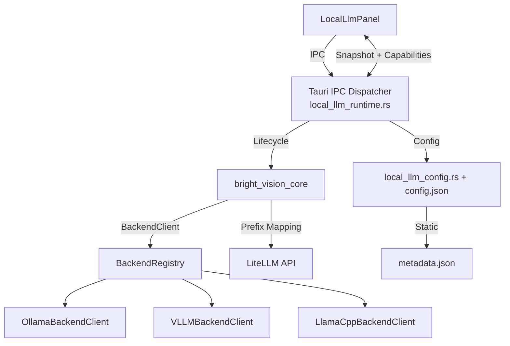

# Design Document

## Overview

Pluggable local LLM runtime abstraction. Decouples model lifecycle (pull/preload/VRAM/keep-alive) from Ollama while LiteLLM continues to handle the inference API layer.

Key decisions:
- **Protocol-first**: `BackendClient(Protocol)` in Python with per-backend implementations. No scattered conditionals.
- **Static metadata fallback**: Bundled JSON registry for runtimes that don't expose VRAM/context APIs (vLLM, llama.cpp).
- **Config hierarchy**: env var → persisted JSON → `ollama` default. Platform-checked at Tauri init.
- **LiteLLM prefix mapping**: Backend name → provider prefix at `ModelRouterConfig` level. Inference loop untouched.

## Architecture



## Components and Interfaces

### 1. Config Resolver
- **Python**: `bright_vision_core/llm_backends/config.py`
- **Rust**: `src-tauri/src/local_llm_config.rs`
- Resolution: `BRIGHTVISION_LLM_BACKEND` env → `~/.config/brightvision/config.json` → `"ollama"`
- Validates against `{ollama, llamacpp, vllm, tgi, mlx-lm}`
- Platform check at Rust init; panics on malformed config (REQ-003.4)

### 2. Backend Protocol & Clients
- **File**: `bright_vision_core/llm_backends/base.py`

```python
class BackendClient(Protocol):
    def preload_models(self, models: list[str]) -> list[str]: ...
    def get_vram_usage(self) -> int | None: ...
    def get_context_window(self, model: str) -> int | None: ...
    def list_available_models(self) -> list[str]: ...
```

| Client | preload_models | get_vram_usage | list_available_models |
|--------|---------------|----------------|----------------------|
| OllamaBackendClient | POST /api/generate keep_alive | GET /api/ps | GET /api/tags |
| VLLMBackendClient | no-op → `[]` | `None` | GET /v1/models (best-effort) |
| LlamaCppBackendClient | no-op → `[]` | `None` | `[]` |

### 3. Backend Registry
- **File**: `bright_vision_core/llm_backends/registry.py`
- Singleton `BackendRegistry` with `get_active()`, `set_active(name)`, `register(name, client)`
- Lazily instantiates from config resolver on first access

### 4. Metadata Registry
- **File**: `bright_vision_core/llm_backends/metadata.json`
- Structure: `{ "models": { "qwen2.5-coder:7b": { "max_context": 32768, "estimated_vram_mb": 4800 }, ... } }`
- Resolution: user override > registry lookup > defaults (8192/4096)

### 5. LiteLLM Prefix Mapper
- **File**: `bright_vision_core/model_router.py` (extend `ModelRouterConfig`)
- New fields: `backend: str = "ollama"`, `provider_prefix: str = "ollama_chat/"`
- Mapping: `ollama`→`ollama_chat/`, `vllm`/`tgi`→`openai/`, `llamacpp`→`openai/`
- Auth injection via `LITELLM_EXTRA_PARAMS` for non-Ollama backends

### 6. Tauri IPC Dispatcher
- **File**: `src-tauri/src/local_llm_runtime.rs`
- `LlmBackendDispatcher` wraps existing `OllamaClient`
- Routes `fetch_tags_models`, `pull_model`, `preload_generate` based on active backend
- Returns structured error `{ code, message }` for unsupported ops

### 7. Frontend Types & Hook
- **Types**: `src/ipc/localLlm.ts` — add `backend` field + `BackendCapabilities` interface
- **Hook**: `src/hooks/useBackendCapabilities.ts` — derives capabilities from backend name
- **UI**: `LocalLlmPanel.tsx` — conditional rendering based on capabilities

## Data Models

```typescript
// TypeScript
interface BackendCapabilities {
  supports_vram_query: boolean
  supports_model_pull: boolean
  supports_context_window_query: boolean
}
```

```json
// ~/.config/brightvision/config.json
{
  "active_backend": "ollama",
  "backend_url": "http://localhost:11434",
  "platform_supported": true,
  "user_vram_override_mb": null
}
```

## Error Handling

| Failure | Response | REQ |
|---------|----------|-----|
| Invalid backend name | Log warn, default to ollama | REQ-001.2 |
| OS incompatibility | Error notification, revert to default | REQ-001.4 |
| Backend unavailable (Python) | Log ERROR, degrade to static metadata | REQ-002.4 |
| Backend unavailable (IPC >2s) | Banner + disable controls | REQ-004.4 |
| Malformed Tauri config | Panic with descriptive message | REQ-003.4 |
| LiteLLM connection failure | Session stall + "Switch Backend" prompt | REQ-006.2 |
| Model not in registry | Apply 8192/4096 defaults, log WARN | REQ-005.2 |


## Correctness Properties

### Property 1: Single Active Backend
At any point in time, exactly one backend is active. `BackendRegistry.get_active()` never returns `None`.

**Validates: Requirements REQ-002.1**

### Property 2: Fallback Guarantee
If any lifecycle call fails, the system degrades to static metadata — never crashes, never returns undefined/uninitialized VRAM values.

**Validates: Requirements REQ-002.4, REQ-005.2**

### Property 3: Prefix Consistency
`ModelRouterConfig.provider_prefix` is always consistent with `ModelRouterConfig.backend`. Changing one updates the other.

**Validates: Requirements REQ-006.1**

### Property 4: Backward Compatibility
When `backend == "ollama"`, all existing behavior (Ollama HTTP calls, IPC commands, UI controls) is unchanged — zero regression.

**Validates: Requirements REQ-003.3**

### Property 5: Config Persistence Round-Trip
`persist_backend_config()` produces valid JSON that `resolve_backend_config()` reads back correctly on next startup.

**Validates: Requirements REQ-001.3**

### Property 6: Platform Safety
A backend unsupported on the current OS is never set as active — validation rejects it before persistence.

**Validates: Requirements REQ-001.4, REQ-003.4**

## Testing Strategy

### Unit Tests
- **Config Resolution** (`tests/core/test_backend_config.py`): env var → config → default hierarchy; invalid backend rejection; OS incompatibility fallback. (REQ-001)
- **Backend Clients** (`tests/core/test_backend_clients.py`): mock HTTP; each client satisfies protocol; OllamaBackendClient logs ERROR on timeout; vLLM/llamacpp no-ops. (REQ-002)
- **Metadata Resolver** (`tests/core/test_metadata_resolver.py`): registry lookup; unknown model defaults; user override priority; WARN logged. (REQ-005)
- **Prefix Mapping** (`tests/core/test_router_prefix.py`): each backend → correct prefix; tier config preserved; auth injection for non-ollama only. (REQ-006)

### Integration Tests
- **Backend Registry** (`tests/core/test_backend_registry.py`): registry loads from config; set_active switches; env override respected. (REQ-002)
- **End-to-End** (`tests/core/test_backend_integration.py`): set env=vllm, verify full chain: config → registry → prefix → no-op preload. (REQ-002, REQ-006)

### Rust Tests
- **Config** (`src-tauri/src/local_llm_config.rs` `#[cfg(test)]`): valid/invalid backends, platform check, panic on malformed. (REQ-001, REQ-003)
- **Dispatcher** (`src-tauri/src/local_llm_runtime.rs` `#[cfg(test)]`): routing logic, structured error payload, ollama backward compat. (REQ-003)

### E2E Tests (Playwright)
- **UI Adaptation** (`e2e/local-llm-backend.spec.ts`): mock vllm IPC → pull button hidden, "Managed externally" shown; mock timeout → banner visible. (REQ-004)
