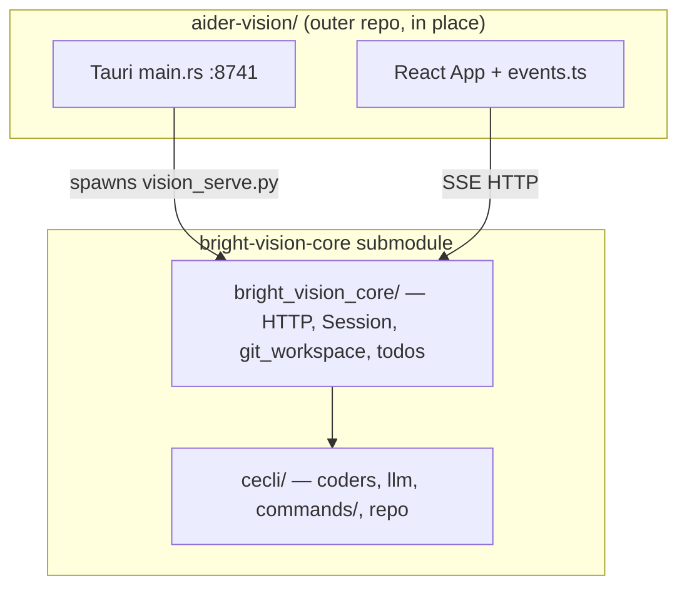

# cecli migration — autonomous execution roadmap

**Owner:** Cursor agent (lead implementer)  
**User role:** approve submodule swap / releases; optional manual dogfood sign-off  
**Status:** Gate A4 passed (20 pytest) — outer repo defaults to `bright-vision-core`; dogfood with `source activate.sh && yarn tauri dev`  
**Last updated:** 2026-05-25

This is the **single execution plan** for moving the desktop shell from `aider_vision_core` to **cecli + `bright_vision_core`**, without cherry-picking git history. Tier rules: [CORE_FILE_MERGE.md](./CORE_FILE_MERGE.md). Pivot context: [BRIGHT_VISION_PIVOT.md](./BRIGHT_VISION_PIVOT.md).

---

## Can the agent do this without help?

| Yes — autonomously | Needs user (cannot fake) |
|--------------------|---------------------------|
| Tier-1 copy, import surgery, async `Session` spike | GitHub write access to push `bright-vision-core` commits |
| `pytest` in `bright-vision-core` | API keys / real LLM smoke (optional; can mock HTTP) |
| `compare-cores.py`, `measure-true-diff.sh` | Subjective “feels identical” dogfood (SUBMODULE_VERIFICATION A–D) |
| Outer-repo path/submodule/`activate.sh`/`main.rs` edits | PyPI publish, Homebrew cask, GitHub repo rename |
| Rebrand pass via `src/brand.ts` + mechanical `rg` | Renaming GitHub org repos / CNAME DNS |

**Definition of done (agent-verifiable):** all gates in § Exit gates pass; outer repo points at `bright-vision-core`; `yarn test:local` green; HTTP integration tests green; one scripted smoke chat (mock or local model).

**Definition of done (product):** above + user dogfood sign-off in [SUBMODULE_VERIFICATION.md](./SUBMODULE_VERIFICATION.md) — optional row in [ROADMAP.md](./ROADMAP.md) #19.

The agent should **not** deinit `aider-vision-core` until Gate A4 passes.

---

## Scope (what we are porting)

Measured delta (`994947a55^` → `aider-vision-core` HEAD, excl. `website/`):

| Bucket | Lines / files | Action |
|--------|---------------|--------|
| Vision integration (13 modules) | ~3,000 insertions | **PORT_NEW** → `bright_vision_core/` |
| Vision tests | ~335 insertions | Copy + fix imports |
| Renamed aider files with edits | ~350 / ~280 | **MERGE_HUNKS** only where shell needs behavior |
| cecli-only trees (agents, `commands/*`, skills) | 185 files | **KEEP** — do not overwrite |

**Not in scope for migration:** website rewrite (Phase D), PyPI/Homebrew (Phase E), adopting all cecli agent features.

---

## Architecture target



**Hard constraint:** event payloads must remain compatible with `src/ipc/events.ts` (no breaking field renames without updating shell in same PR).

---

## Phases & gates

### Phase 0 — Baseline (one session)

| ID | Task | Verify |
|----|------|--------|
| 0.1 | Record submodule SHAs in this doc (table below) | `git submodule status` |
| 0.2 | Run `python3 scripts/compare-cores.py` | output saved in commit or session notes |
| 0.3 | Run `./scripts/measure-true-diff.sh` | confirms ~3k Vision layer |
| 0.4 | `cd aider-vision-core && pytest tests/basic/test_http_api.py tests/basic/test_git_workspace.py -q` | green on current engine |

**Rollback:** none (read-only).

---

### Phase A — `bright-vision-core` port (blocking)

Work on branch `port/vision-api-on-cecli` **inside** `bright-vision-core` repo.

#### A1 — Bulk Tier-1 copy

| ID | Task | Verify |
|----|------|--------|
| A1.1 | `./scripts/port-vision-core-to-bright.sh` (dry-run) | review list |
| A1.2 | `./scripts/port-vision-core-to-bright.sh --apply` | `bright_vision_core/*.py` exist |
| A1.3 | Copy vision tests from script list | files under `bright-vision-core/tests/basic/` |
| A1.4 | Commit in `bright-vision-core` | `git status` clean |

**Do not** use `--full-tree` unless A1.2 fails for a specific file.

#### A2 — Package & entrypoints

| ID | Task | Verify |
|----|------|--------|
| A2.1 | Add `bright_vision_core/` package to `pyproject.toml` | `pip install -e .` succeeds |
| A2.2 | Console scripts: `bright-vision-core-serve` → `bright_vision_core.cli_serve:main` (or equivalent) | `which bright-vision-core-serve` |
| A2.3 | `scripts/vision_serve.py` wrapper in submodule root | path matches outer `main.rs` expectation |
| A2.4 | `brand.py` strings → Bright Vision | grep package |

#### A3 — Import surgery (mechanical)

Replace in `bright_vision_core/`:

- `from aider_vision_core` → `from bright_vision_core` (internal)
- `from aider_vision_core.coders` → `from cecli.coders`
- `from aider_vision_core.commands` → map to `cecli.commands` (see A4)
- `from aider_vision_core.main` / `models` / `repo` → `cecli.*`

| ID | Task | Verify |
|----|------|--------|
| A3.1 | `rg 'aider_vision_core' bright-vision-core/bright_vision_core` | zero hits |
| A3.2 | `python -c "import bright_vision_core.http_api"` | no ImportError |

#### A4 — Async session adapter (critical path)

cecli: `async def send_message` / `async def create`.  
Vision `session.py`: sync generator `run_turn()`.

| ID | Task | Verify |
|----|------|--------|
| A4.1 | Spike `bright_vision_core/async_bridge.py` — run coroutine, yield chunks to sync generator | unit test or minimal script |
| A4.2 | Rewrite `Session.create` to use `await Coder.create(...)` (or sync wrapper documented in cecli) | session constructs without error |
| A4.3 | `run_turn` drains `EventIO` same as today | compare event types to `events.ts` |
| A4.4 | Preserve `yield_stream` / token / done payload shape | `test_http_api.py` |

**If cecli exposes a sync entry:** use it only if documented; prefer explicit asyncio loop per turn.

#### A5 — `git_workspace` / `RepoSet`

cecli has no superproject model today — **port as new code**, do not merge from `cecli/repo.py` wholesale.

| ID | Task | Verify |
|----|------|--------|
| A5.1 | Wire `create_git_workspace` to cecli `GitRepo` / io | `test_git_workspace.py` |
| A5.2 | Session `create()` uses `create_git_workspace` | test_superproject if present |

#### A6 — Commands bridge

Do **not** copy monolithic `commands.py`. For each Vision-only command the HTTP layer needs:

| ID | Task | Verify |
|----|------|--------|
| A6.1 | List commands invoked from `http_api` / `session` | `rg 'commands\.(cmd_|)' bright_vision_core` |
| A6.2 | Map to cecli `commands/*` modules or thin `commands_bridge.py` | pytest for add/drop/git if used |

#### A7 — Tier-3 hunks (only if tests fail)

| File | Rule |
|------|------|
| `cecli/coders/base_coder.py` | Vision headless / submodule roots — minimal diff |
| `cecli/main.py` | API mode flags only |
| `cecli/repo.py` | Only if `git_workspace` cannot stand alone |

Use `python3 scripts/compare-cores.py --diff <path>` before editing.

#### A8 — Test gate (agent must run)

```bash
cd bright-vision-core
pip install -e ".[dev]"  # or project-standard install
pytest tests/basic/test_http_api.py tests/basic/test_git_workspace.py \
  tests/basic/test_http_session_todos.py tests/basic/test_workspace_todos.py -q
```

| Gate | Criterion |
|------|-----------|
| **A4** | All above pytest green |
| **A4b** | `bright-vision-core-serve` binds :8741; `curl -s -o /dev/null -w '%{http_code}' http://127.0.0.1:8741/health` → 200 or documented health route |
| **A4c** | `POST /sessions` returns session id (use test client or httpx script) |

Commit and note SHA in § Submodule pins.

**Rollback:** outer repo still uses `aider-vision-core`; discard bright branch.

---

### Phase B — Outer repo submodule swap

Only after **Gate A4**.

| ID | Task | Verify |
|----|------|--------|
| B1 | Pin `bright-vision-core` submodule to port branch SHA | `.gitmodules` + parent commit |
| B2 | `activate.sh` — `pip install -e bright-vision-core`, `ENGINE=bright-vision-core` | shell activate |
| B3 | `src-tauri/src/main.rs` — resolve `vision_serve.py` under bright root | file exists |
| B4 | Env aliases: `BRIGHT_VISION_*` read; `AIDER_VISION_*` fallback one release | grep both in Rust/TS |
| B5 | `yarn test:local` | green |
| B6 | `git submodule deinit -f aider-vision-core` + remove from `.gitmodules` | only after B5 |

**Rollback:** repoint submodule to previous `aider-vision-core` SHA; restore `.gitmodules`.

---

### Phase C — Rebrand (parallel or after B)

Mechanical; does not block engine swap.

| ID | Task | File |
|----|------|------|
| C1 | Constants | `src/brand.ts` |
| C2 | Tauri bundle | `src-tauri/tauri.conf.json`, `Cargo.toml` |
| C3 | Assets | `assets/bright-vision-*` → `src/assets/brand/` |
| C4 | localStorage migration | settings loaders |
| C5 | Docs / AGENTS.md | strings + links |

See [BRIGHT_VISION_PIVOT.md](./BRIGHT_VISION_PIVOT.md) Phase C table.

---

### Phase D–E — Deferred (user / release)

| Phase | Owner |
|-------|--------|
| D — `docs/index.html` website | User + agent content pass; no cherry-pick |
| E — PyPI, Homebrew, GitHub rename | User credentials |

---

## Session plan (agent self-scheduling)

Execute in order; one phase per session unless blocked.

| Session | Goal | Exit |
|---------|------|------|
| **S1** | Phase 0 + A1–A2 | `bright_vision_core` tree + installable package |
| **S2** | A3 + A4 spike | import clean; one `run_turn` in pytest |
| **S3** | A5–A6 + A8 | pytest gate A4 |
| **S4** | B1–B5 | outer repo on bright engine; `yarn test:local` |
| **S5** | C1–C5 + dogfood doc update | rebrand mechanical; optional user sign-off |

If A4 blocks >2 iterations, document blocker in § Blockers and keep `aider-vision-core`.

---

## Exit gates (checklist)

Copy into PR description; agent checks all before claiming “migration complete”.

```markdown
### Phase A (bright-vision-core)
- [ ] Tier-1 modules in `bright_vision_core/` (no `aider_vision_core` imports)
- [ ] `bright-vision-core-serve` entrypoint works
- [ ] Async session: `run_turn` streams tokens + `done` event
- [ ] `test_http_api.py` green
- [ ] `test_git_workspace.py` green
- [ ] `test_http_session_todos.py` / `test_workspace_todos.py` green

### Phase B (outer repo)
- [ ] Submodule pinned to bright SHA
- [ ] `yarn test:local` green
- [ ] Tauri finds `scripts/vision_serve.py` under bright root
- [ ] `aider-vision-core` deinit only after above

### Parity (shell unchanged)
- [ ] `src/ipc/events.ts` types still satisfied
- [ ] Tasks tab API unchanged
- [ ] Local LLM path unchanged (outer `local_llm_runtime.rs`)
```

---

## Submodule pins (update as you go)

| Submodule | Branch / SHA | Notes |
|-----------|--------------|-------|
| `aider-vision-core` | _(current prod)_ | keep until Gate A4 |
| `bright-vision-core` | `main` @ TBD | after port branch merge |

---

## Blockers log

| Date | Blocker | Resolution |
|------|---------|------------|
| — | — | — |

---

## Risk register

| Risk | Mitigation |
|------|------------|
| Async/session deadlock | Dedicated `async_bridge`; timeout in HTTP layer |
| Event schema drift | Diff first SSE payload against golden JSON in test |
| Submodule git wrong repo | `git_workspace` tests + SUBMODULE_VERIFICATION |
| Scope creep into cecli agents | Explicit “KEEP cecli” in code review checklist |
| Rsync over `cecli/` | Forbidden in `port-vision-core-to-bright.sh` |

---

## Success likelihood (planning estimate)

| Milestone | Confidence |
|-----------|------------|
| pytest HTTP/workspace green on bright | **85%** |
| Outer swap + `yarn test:local` | **80%** |
| Full dogfood parity with today | **70%** (edge cases) |
| Zero regressions without manual pass | **50%** |

---

## Commands quick reference

```bash
# Inventory
python3 scripts/compare-cores.py
python3 scripts/compare-cores.py --list vision-only
./scripts/measure-true-diff.sh

# Port
./scripts/port-vision-core-to-bright.sh --apply

# Test (current engine)
cd aider-vision-core && pytest tests/basic/test_http_api.py -q

# Test (target engine)
cd bright-vision-core && pip install -e . && pytest tests/basic/test_http_api.py -q

# Outer
yarn test:local
yarn tauri dev
```

---

## Related docs

- [CORE_FILE_MERGE.md](./CORE_FILE_MERGE.md) — per-file tiers  
- [BRIGHT_VISION_PIVOT.md](./BRIGHT_VISION_PIVOT.md) — product/rebrand phases  
- [SUBMODULE_VERIFICATION.md](./SUBMODULE_VERIFICATION.md) — manual superproject checks  
- [USER_WORKFLOW.md](./USER_WORKFLOW.md) — workspace root rules  
